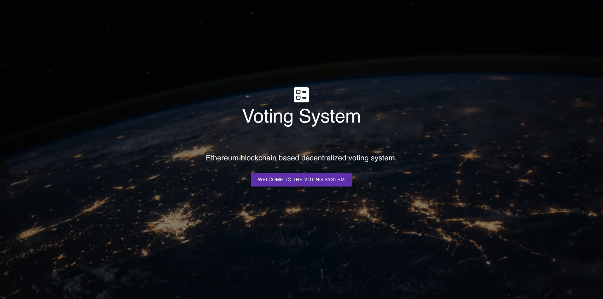
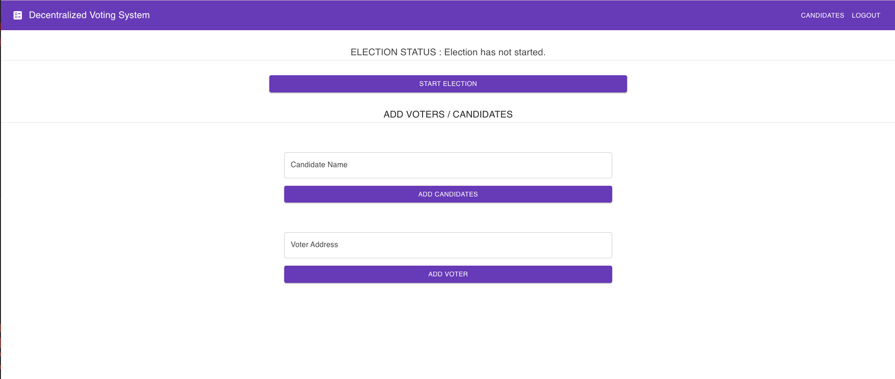
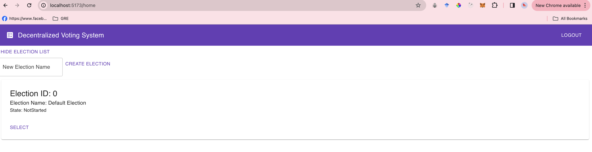
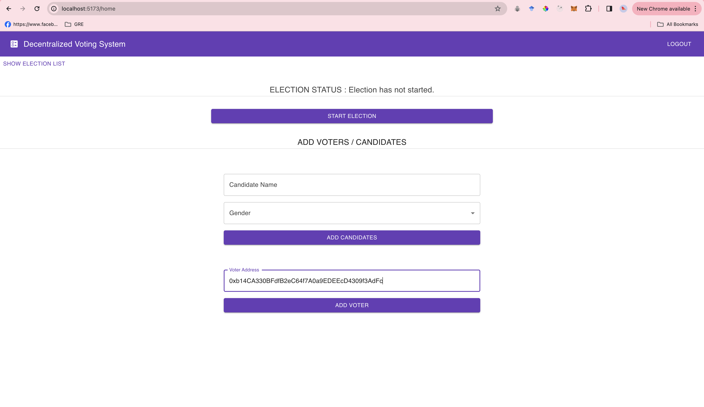
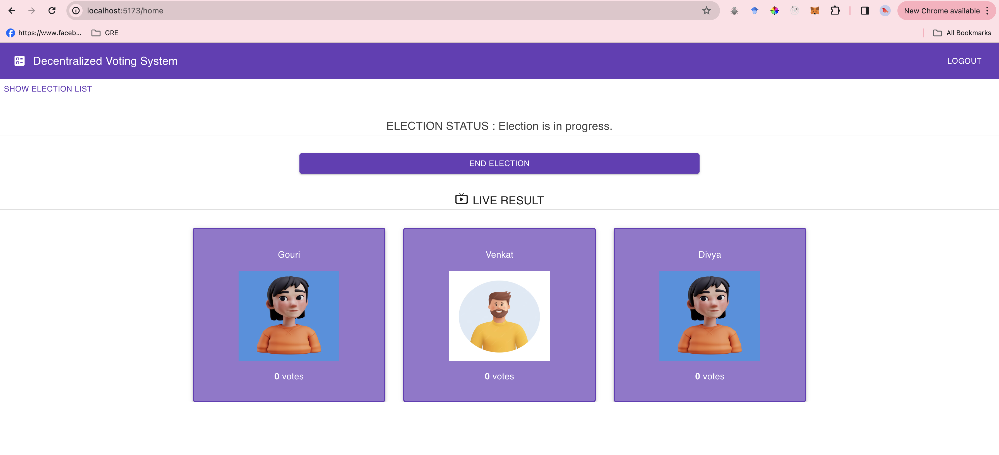
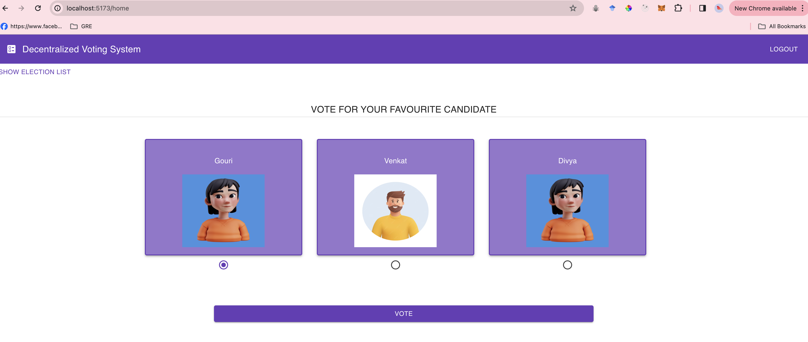
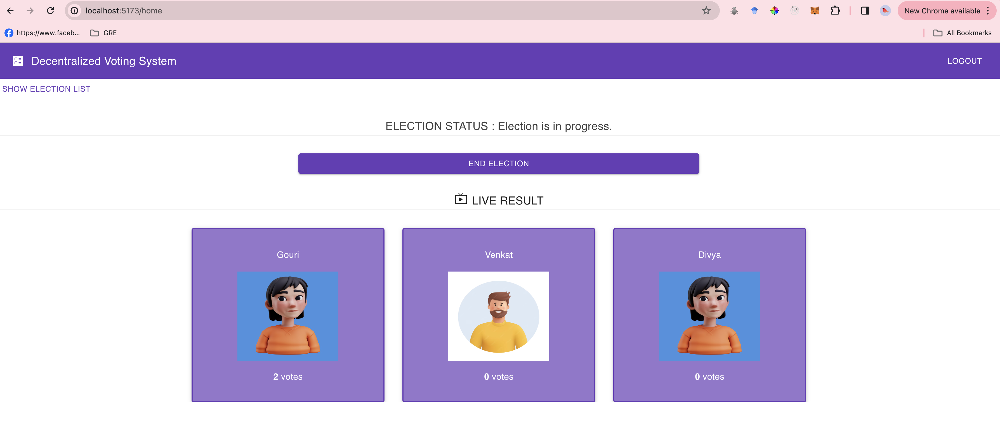
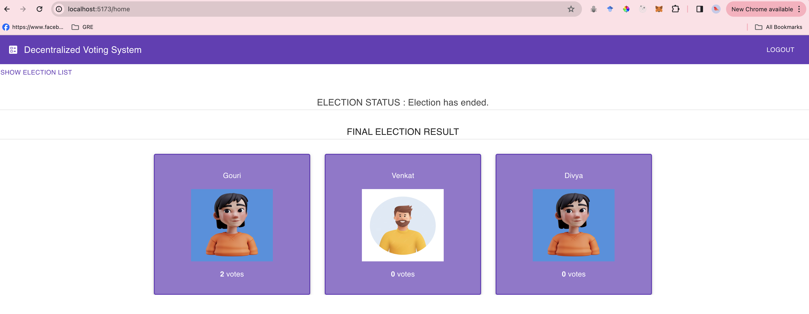
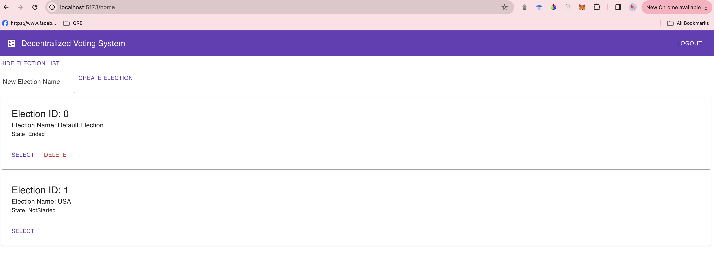

# Decentralized Voting System

<p>The use of technology is day by day becoming important to meet the the needs of human. Election have a great importance in democracy, it decide who will rule a nation or an organization to decide the policies for citizens.</p>
<p>The blockchain is emerging, distributed and decentralized technology that promises to improve different areas of many industeries. Adopting blockchain concepts into voting system can bring transparent, distributed, immutable and trustless ledger and to overcome the problems of the traditional voting system.</p>

### Tech Stack

- ReactJS
- Metamask
- Ganache
- Solidity
- Node 18.2.0

### Features

This application is a voting system which has multiple features:

- In this application after connecting to metamask account user can enter in the voting system.

Admin:

1. Select the Election: The admin is responsible for selecting which election to select.
2. Start multiple election: The admin is authorized to start and end multiple elections simultaneously.
3. Access the system: After entering the system, the admin is responsible to add election details.
4. Add Voters: Admin can add multiple voters for election using the corressponding address.
5. Register Candidates: Admin can register Candidates for election.
6. Start the election: Admin is authorized to start the election officially.
7. End the election: After the voting completion, admin is authorized to end election officially.
8. View results: Admin can access and review the final results after the election ended.

Voter:
Voter can give vote to the candidates and see the final election results.

### Steps to run the Project

1. Clone the project

```bash
cd decentralized-voting-system
git clone https://github.com/tanwardivya/decentralized-voting-system
```

2. Start Ganache

Open the Ganache GUI client to start the local blockchain instance.

3. Compile & Deploy Election Smart Contract

```bash
truffle migrate --reset
```

Note: We must migrate the election smart contract each time restart ganache.

4. Configure Metamask

- Unlock Metamask
- Connect metamask to the local Etherum blockchain provided by Ganache.
- Import an account provided by Ganache.

5. Run the Front End Application

```bash
cd voting-dapp
npm install
npm run dev
```

Visit URL in your browser: <http://localhost:5173>

## Screenshots

Landing page:
 &nbsp;
Admin page:
 &nbsp;
Select Election:
 &nbsp;
Add Voter:
 &nbsp;
View Candidate:
 &nbsp;
Voting Page:
 &nbsp;
Election Progress:
 &nbsp;
Election Result:
 &nbsp;
Creating a election:
 &nbsp;
